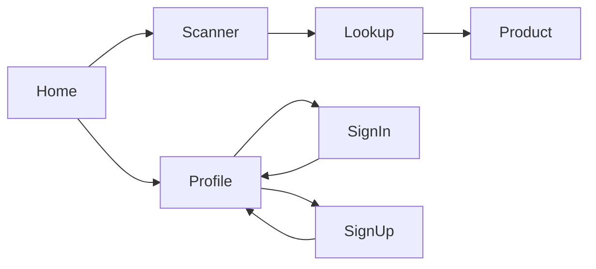

# IngreCheck Phase 1

The workspace at `/Users/lz-57/Desktop/ivy` is empty. Scaffold a new Expo app there. The app opens on Home. Scanning, lookup, and ingredient explanations work with no account. Login and signup are optional and exist only to show a Profile. No subscriptions, scan history, analytics, or health scores.

## Stack and template

- Expo SDK 57 (React Native 0.86, Node 22.13+) via `npx create-expo-app@latest . --template blank-typescript`.
- Navigation: `@react-navigation/native` and one native stack: Home, Scanner, Product, Profile, Sign in, and Sign up. There is no auth gate. Camera permission is requested only when the scanner opens.
- Auth: `@supabase/supabase-js` with the public anon key. Session stored in `expo-secure-store`. URL scheme `ingrecheck` for email confirmation and OAuth return. A missing Supabase URL or anon key leaves scanning usable and shows a short setup note on Profile.
- Email: `signUp` and `signInWithPassword`, plus a check-your-email state and a password-reset link back into the app.
- Google: native ID token from `@react-native-google-signin/google-signin`, then `supabase.auth.signInWithIdToken({ provider: 'google' })`.
- Apple: native `expo-apple-authentication` on iOS, with a hashed nonce, then `signInWithIdToken({ provider: 'apple' })`. On Android, Apple uses `signInWithOAuth` plus `expo-web-browser`. Offering Google requires Sign in with Apple on iOS.
- Product data stays a direct Open Food Facts API v3 call from the phone. Supabase stores only the auth user. No custom tables and no saved scans in Phase 1.
- Camera: `expo-camera` `CameraView` with `barcodeTypes` `ean13`, `ean8`, `upc_a`, and `upc_e`. Disable the scan callback while a lookup is in flight.
- Open Food Facts: `GET https://world.openfoodfacts.org/api/v3/product/{code}?fields=code,product_name,brands,image_front_url,ingredients_text,ingredients,nutriments,nutrition_data_per,allergens_tags,traces_tags,categories,nova_group,countries,countries_tags`. User-Agent `IngreCheck/1.0 (https://world.openfoodfacts.org)`.
- Styling: React Native `StyleSheet` and tokens in `src/theme`. Camera plugin requests camera access only, with `recordAudioAndroid: false`.
- Config: `EXPO_PUBLIC_SUPABASE_URL` and `EXPO_PUBLIC_SUPABASE_ANON_KEY` in `.env`, listed in `.env.example`, and gitignored in `.env`. Google iOS and web client IDs are public client IDs in env as well. No service-role key in the app.



## Profile and optional auth

Home has a Profile control. It is available immediately, and scanning does not depend on it.

When nobody is signed in, Profile explains that an account is optional and offers Create account, Sign in, Continue with Google, and Continue with Apple. After a successful sign-in, the stack returns to Profile.

When someone is signed in, Profile shows the available identity only: display name when the provider returns one, email, and the sign-in method. Sign out clears the local session and returns Profile to the signed-out state. Profile does not show scan history, health data, or settings beyond the account.

Email signup collects email and password, validates both on the client, and calls Supabase. If confirmation is required, the screen tells the user to open the email. The confirmation redirect uses `ingrecheck://auth/callback`. Sign-in uses the same form in login mode. Wrong password, unknown user, weak password, and network errors get plain-language messages and a retry. Forgot password sends a reset email to `ingrecheck://auth/reset`.

Google and Apple buttons show a loading state and a friendly error if the provider is cancelled, unavailable, or not configured. A stored session restores the signed-in Profile on the next launch. Home and the scanner stay available either way.

Dashboard steps the developer completes outside the repo, documented in the README:

- Create a Supabase project and enable Email, Google, and Apple providers.
- Add redirect URLs `ingrecheck://auth/callback` and `ingrecheck://auth/reset`.
- Google Cloud: web client ID for Supabase, plus iOS and Android client IDs. Android needs the debug SHA-1.
- Apple: enable Sign in with Apple on the bundle ID, and add that bundle ID to the Supabase Apple client IDs.

Live Google and Apple sign-in cannot succeed until those credentials exist. The code and the setup docs ship together. Unit tests mock the Supabase client.

## App structure

```
src/theme/
src/types/          Product, LookupResult, IngredientEntry, Auth
src/config/         Supabase env, Open Food Facts URL and User-Agent
src/services/       supabase.ts, auth.ts, openFoodFacts.ts
src/utils/          barcode, normalizeProduct, nutrition, allergens, nova, matchIngredient, authValidation
src/data/           ingredient knowledge base
src/components/     brand mark, auth form, scan frame, product sections, state views
src/screens/        HomeScreen, ScannerScreen, ProductScreen, ProfileScreen, SignInScreen, SignUpScreen
src/navigation/     RootNavigator
App.tsx
```

Screens stay thin. Auth calls, product fetch, normalization, and ingredient matching stay outside UI.

## Product screens

**Home.** Wordmark, tagline “Scan ingredients. Know instantly.”, short explanation, “Scan a product”, “Enter a barcode”, and a Profile button. Original leaf-plus-scan-frame mark in `assets/`.

**Scanner.** Camera permission explains that barcodes are read on device and images are not uploaded. Denied and unavailable states lead to manual entry. Frame copy: “Align the barcode inside the frame.” Manual entry uses a numeric keyboard, trimmed input, check-digit validation for 8, 12, and 13 digit codes, and the same lookup service as the camera. Recovery covers not found, offline, timeout, malformed response, and server errors.

**Product.** Image or placeholder, name, brand, barcode, category, and countries when present. Original ingredient text is preserved. Recognized ingredients expand into local explanations. Unknown or ambiguous names stay uncertain. Nutrition uses `nutrition_data_per` and shows a value only when that key exists. A stored `0` stays `0`. Salt and sodium stay separate. Allergens distinguish listed tags, traces, and missing data, with a note to check the package. NOVA 1–4 appears only when `nova_group` is 1, 2, 3, or 4. Attribution links to `https://world.openfoodfacts.org/product/{code}`. “Scan another product” returns to the scanner.

## Ingredient knowledge base

Local seed in `src/data/ingredients.ts`, about 15 real entries: citric acid, ascorbic acid, lecithins, xanthan gum, sodium benzoate, potassium sorbate, monosodium glutamate, sucrose, glucose, fructose, glucose-fructose syrup, palm oil, salt, cocoa, and soy lecithin. Each entry has synonyms, a real taxonomy or E-number where one exists, a functional label, a plain explanation, why it is used, a neutral consideration, and real FDA, EFSA, or JECFA URLs. No toxic or safe scores. Matching prefers the Open Food Facts ingredient id, then normalized names and synonyms.

## Privacy and quality

An account is optional. When someone signs in, the app keeps the email and the name the provider returns, and shows them on Profile. The app does not ask for phone numbers, contacts, or location. Camera images stay on the device. Product lookup does not send the user id to Open Food Facts.

- TypeScript strict. Product lookup timeout about 12 seconds via `AbortController`.
- Tests: email and password validation, auth error mapping, barcode validation, product normalization, ingredient matching, NOVA, allergens, and nutrition fallbacks.
- Run `tsc`, `jest`, and `npx expo-doctor`. Attempt `npx expo run:ios` if Xcode is available. Document Android if the SDK or emulator is missing.
- README covers Node, Xcode, Android Studio, Supabase and OAuth dashboard setup, `.env`, native run commands, camera limits on the simulator, and known limitations. No Expo Go instructions.
