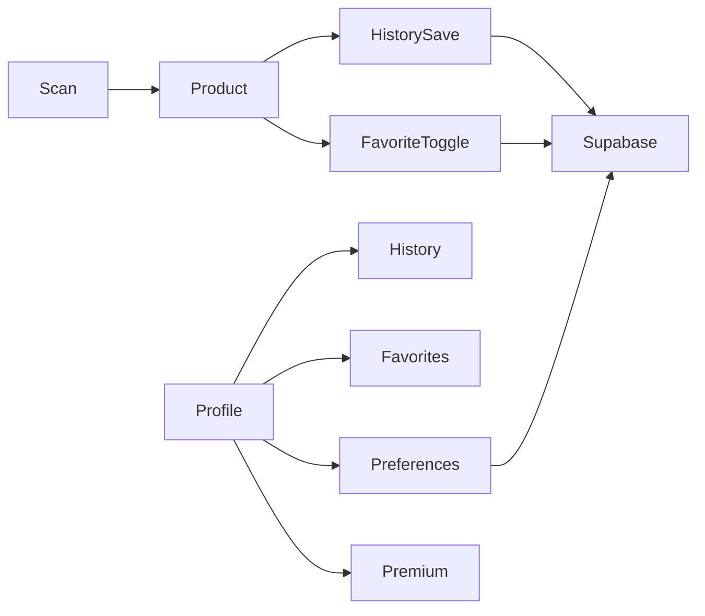

# IngreCheck Phase 2

Keep the current scanner, product page, Open Food Facts client, and navigation. Auth already exists in [`src/services/supabase.ts`](src/services/supabase.ts), [`src/services/auth.ts`](src/services/auth.ts), and [`src/context/AuthContext.tsx`](src/context/AuthContext.tsx) (email, Google, Apple, password reset, SecureStore session). Phase 2 adds cloud data and settings around that. It does not replace the client or force login before a scan.

The SQL cannot be applied from this machine. The migration file will be ready to paste into the Supabase SQL Editor. RLS will not be described as verified until two real accounts are tested.

## What stays

- [`src/screens/ScannerScreen.tsx`](src/screens/ScannerScreen.tsx), product sections, barcode validation, and [`src/services/openFoodFacts.ts`](src/services/openFoodFacts.ts).
- Session storage in the existing chunked SecureStore adapter. Passwords and tokens stay out of AsyncStorage.
- Signed-out scanning. Login is requested only when saving history, favorites, or preferences.
- Existing `.env` / `.env.example` keys. Add `EXPO_PUBLIC_PREMIUM_MODE` (`disabled`, `demo`, or `production`). `.env` is already gitignored.

## New dependency

```bash
npx expo install @react-native-async-storage/async-storage
```

`@supabase/supabase-js` and `react-native-url-polyfill` are already installed. Do not add a second Supabase client. Keep using [`src/services/supabase.ts`](src/services/supabase.ts).

## Database

Add [`supabase/migrations/20261009140000_phase2_user_data.sql`](supabase/migrations/20261009140000_phase2_user_data.sql) for the SQL Editor:

- `profiles` (`id` references `auth.users`, display name, timestamps). A trigger creates the row on signup. Clients cannot insert a profile for another user.
- `scan_history`, `favorite_products`, `ingredient_preferences` with user foreign keys, `on delete cascade`, and indexes on `user_id`, `scanned_at` / `created_at`, and `barcode`.
- Unique `(user_id, barcode)` on favorites. Unique `(user_id, ingredient_name, preference_type)` on preferences. `preference_type` is constrained to `avoid` or `monitor`.
- RLS enabled on all four tables. Policies use `auth.uid()` for select, insert, update, and delete, including a check that inserted `user_id` equals `auth.uid()`. Profile policies compare `id` to `auth.uid()`.
- `delete_own_account()` as a security-definer function that deletes only `auth.uid()` from `auth.users`, so related rows cascade. Execute is granted only to `authenticated`. If Supabase rejects that function, the app shows dashboard steps instead of using a service-role key.

## App behavior

- **History.** When a signed-in user opens a successful product, save barcode, name, brand, and image URL. Skip a new row if that user saved the same barcode in the last 15 minutes. Newest first, 20 per page. Delete one item or clear all after confirmation. Reopen uses the existing lookup, with an AsyncStorage product cache only when the network fails. The cache label says it is a saved copy, not a fresh lookup.
- **Favorites.** Heart action on [`src/screens/ProductScreen.tsx`](src/screens/ProductScreen.tsx). Optimistic toggle rolls back if the server rejects it. The unique constraint blocks duplicates.
- **Preferences.** Add, edit, and remove `avoid` / `monitor` entries. On the product page, an exact normalized name match against the existing ingredient text shows “You asked to avoid/monitor this.” It does not claim allergen detection. Matching reuses [`normalizeIngredientName`](src/utils/matchIngredient.ts).
- **Profile.** Extend [`src/screens/ProfileScreen.tsx`](src/screens/ProfileScreen.tsx) with email, editable display name, links to history, favorites, preferences, and premium, plus sign-out confirmation and account deletion.
- **Premium.** New information screen with proposed test prices of ₹99 monthly and ₹699 yearly, marked as not final. Restore purchases is a disabled placeholder. No checkout and no success state. [`src/features/entitlements.ts`](src/features/entitlements.ts) is the only gate: `disabled` hides premium tools, `demo` unlocks them for testing, `production` keeps free limits and never trusts a local `isPremium` flag. Free scanning, ingredients, nutrition, allergens, and NOVA stay open. Extended history beyond 50 visible items is the only gated tool in this phase.
- **Signed-out saves.** The product still appears. Save actions explain that an account is optional and link to sign-in.



## Tests and checks

Unit tests for history dedupe, favorite duplicate handling, preference validation, entitlement modes, and cache-versus-cloud labels. Mock Supabase. Do not claim RLS passed from unit tests. The README gets a two-account checklist: Account A’s rows must be invisible and unwritable to Account B.

Run `npx tsc --noEmit` and `npm test`. A new native binary is not required for these JavaScript changes. After the SQL is applied and `.env` is filled, restart with `npx expo start --dev-client` on the existing development build.
